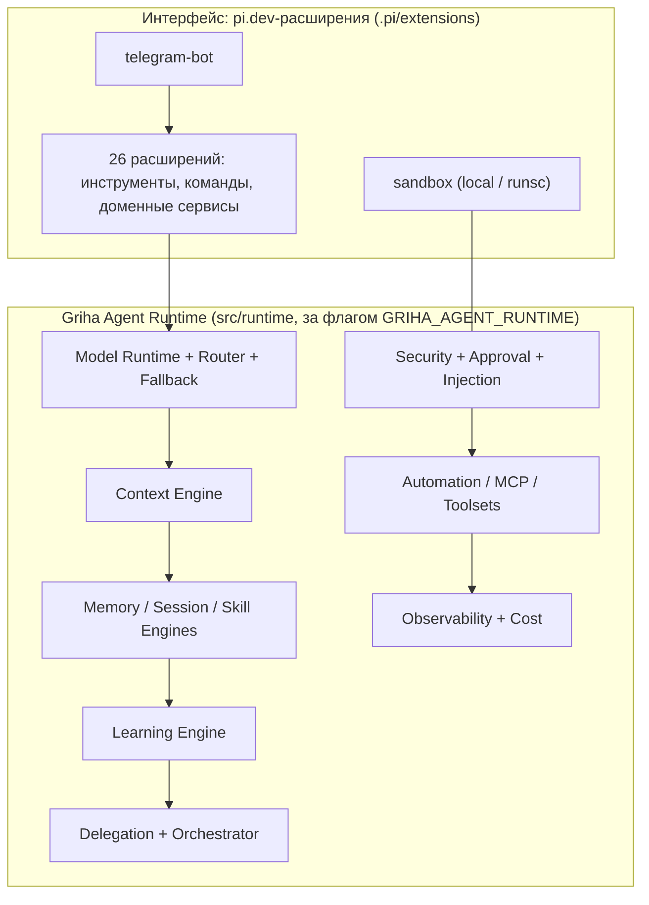
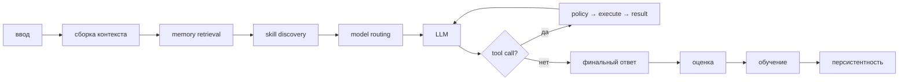

# griha-ai

Агент **Гриша** — самостоятельный TypeScript-агент на платформе **pi.dev**: замкнутый цикл обучения, слоистая память, именованный Bot Mode, автономное создание skills.

## Роль агента

Профессиональный ассистент **менеджера / секретаря / бухгалтера** — расписания, документы, отчёты, переписка, исследования, заметки со встреч, лёгкая финансовая поддержка. Инструменты программирования — вторичны.

## Ключевые принципы

1. **Единый Agent Runtime.** Вся логика агента (маршрутизация моделей, контекст, память, скиллы, обучение, делегирование, автоматизация, безопасность) собрана в нативный TypeScript-runtime `apps/agent/src/runtime/` — а не размазана по расширениям.
2. **Платформа — только интерфейс.** pi.dev предоставляет движок агента (события, LLM-цикл, tool-calling, сессии). Бизнес-логика Гриши — расширения `apps/agent/.pi/extensions/`.
3. **Всё новое — за флагом.** Runtime-подсистемы включаются переменной `GRIHA_AGENT_RUNTIME=1`; при выключенном флаге поведение ровно такое же, как до их появления (off = 1:1).
4. **Безопасность прежде автономности.** Любой side-effect проходит классификацию риска и approval; LLM не может обойти security policy; опасный код — только в sandbox (runsc/gVisor).
5. **Память не бездонная.** Не каждая фраза пользователя попадает в долговременную память: confidence, повторяемость, противоречия, устаревание.
6. **Skills — процедурная память.** LLM никогда не перезаписывает production-skill напрямую: propose → validate → evaluate → approve → version → rollback.

## Стек

- **Платформа**: [pi.dev](https://pi.dev) — `@earendil-works/pi-coding-agent`, `pi-agent-core`, `pi-ai` (v0.85.1)
- **Язык**: TypeScript (strict, NodeNext/ESM, target ES2022)
- **Память**: `better-sqlite3` + FTS5 + векторный поиск (RRF-гибрид)
- **Telegram**: `grammy` (long polling)
- **Тесты**: `node:test` через `tsx` (1127 unit + golden fixtures)
- **Lint**: ESLint 10 (flat config; TS-парсинг через `@babel/eslint-parser` — typescript-eslint не поддерживает TS 7)

## Внешние инструменты

Рендер PDF/PPTX-отчётов вынесен в отдельные пакеты (`packages/render-contracts`,
`packages/render-tools`) и CLI `apps/render-cli`; активируются флагами — по умолчанию
старое поведение 1:1. Отдельно — read-only диагностика окружения: `apps/telegram-cli doctor`.

```bash
npm run render                            # build CLI + запуск bin.js
GRIHA_RENDER_CLI=1 ../../node_modules/.bin/pi   # рендер через spawn CLI
node apps/telegram-cli/dist/bin.js doctor # диагностика окружения (offline)
```

Подробности и флаги — [docs/EXTERNAL-TOOLS.md](docs/EXTERNAL-TOOLS.md).

## Наблюдаемость

Журнал работы Griha **без LLM** — JSONL в `~/.grish-ai/obs/` (пакет
`packages/observability`). CLI `griha-obs` для терминала/ssh и agent-tools
`obs_summary`/`obs_query` для операторского агента на Mac Mini.

```bash
npm run obs                                   # build CLI + запуск bin.js
node apps/obs-cli/dist/bin.js tail --lines 100
node apps/obs-cli/dist/bin.js query --event gate.block --limit 20
```

`GRIHA_OBS=0` выключает запись; `GRIHA_OBS_DIR` меняет каталог. Подробности —
[docs/OBSERVABILITY.md](docs/OBSERVABILITY.md).

## Отчётные данные (расходы)

Пакет `@griha/report-data` читает `expense_documents` (compact/expanded/problems) без
LLM/OCR/PDF. Agent-tools: `report_data_expenses`, `report_data_problems`, `document_fill`
(дозаполнение проблемных чеков). Scope: в группе — только текущая группа; в личке —
`chatId` или `groupQuery` (название из setup) + ACL. Подробнее —
[docs/REPORT_DATA.md](docs/REPORT_DATA.md).

## Самообновление

Безопасный self-update с GitHub `demossml/grihaAi` (main): Telegram `/update` (owner)
или tool `system_update`, либо CLI `npm run system-update -w @griha/agent`. Dirty →
отказ, build упал → без restart, данные `~/.grish-ai` не трогаются. Подробнее —
[docs/SYSTEM_UPDATE.md](docs/SYSTEM_UPDATE.md).

## Generation Policy

Детерминированные бюджеты генерации (`apps/agent/src/runtime/generation/`, без LLM):
`resolveGenerationBudget` (профили trivial/simple/medium/complex, hard-cap 8192) +
`BudgetAllocator` (расширение в пределах hard/maxExtensions). Флаг
`GRIHA_GENERATION_POLICY` (default off). Подробнее — [docs/GENERATION_POLICY.md](docs/GENERATION_POLICY.md).

## Flash Router

Маршрутизация сообщений (`apps/agent/src/runtime/routing/`): детерминированный
`tryRuleRoute` + опциональный LLM Flash (`routeWithFlash`) + `fallbackRoute`.
Decision → `resolveGenerationBudget`. Флаг `GRIHA_FLASH_ROUTER` (default off), без
истории/ACL/сумм в Flash. Подробнее — [docs/FLASH_ROUTER.md](docs/FLASH_ROUTER.md).
Pool-wire (Phase 2.1) — `preparePoolRouting` перед `session.prompt`, fail-safe,
флаги off → ноль накладных. Phase 2.2 — `createCallFlash` (deepseek-v4-flash,
max_tokens 256) + `ModelRouter.callWithDecision` применяет `initialMaxTokens`/
`temperature` из бюджета при policy on.

## Observability

`@griha/observability` пишет JSONL-журнал (`~/.grish-ai/obs/`): turn chain
(`turn.start`/`end`), gate, routing, budget (`generation.budget`/`extend*`/`finish`),
tools, send, reminder. Один `correlationId` на ход. Флаг `GRIHA_OBS=0` — off.
Подробнее — [docs/OBSERVABILITY.md](docs/OBSERVABILITY.md).

## Быстрый старт

```bash
npm install               # workspace-зависимости
npm run typecheck         # turbo: typecheck всех пакетов (собирает @griha/*)
npm test                  # turbo: тесты агента (1127 unit)
npm run lint              # eslint apps packages (0 ошибок)
npm run build             # turbo: сборка пакетов в dist/

# Запуск агента — из apps/agent (pi читает .pi/ и skills/ оттуда):
cd apps/agent
../../node_modules/.bin/pi
# В pi при первом запуске откроется мастер настройки:
#   провайдер → модель → API-ключ (или /setup повторно)

# Включение Griha Agent Runtime (все подсистемы из docs/GRIHA_PARITY_MATRIX.md):
GRIHA_AGENT_RUNTIME=1 ../../node_modules/.bin/pi
```

## Архитектура в одном абзаце

Гриша — это две половины. **Верхняя** — расширения pi.dev (интерфейс: инструменты для LLM, команды, Telegram-бот, память, доменные сервисы — финансы/CRM/тревел/документы). **Нижняя** — `src/runtime/`, нативный TypeScript-агентный рантайм с 17 движками (model, context, memory, session, skill, learning, delegation, programmatic, automation, security, mcp, toolsets, telegram, proactive, profiles, observability, kernel), который включается флагом и постепенно подключает существующие прод-пути к себе, не ломая их.



## Настройка групп в Telegram

При добавлении Гриши в группу бот **молчит** в ней, пока её не настроят (silent-until-configured):
настроившему в личные сообщения приходит меню с пресетами правил (или `/setup` в ЛС).
После выбора пресета (или «оставить как есть») в группе действуют выбранные правила
(по умолчанию — только @mention/reply). Подробности: `docs/TELEGRAM-BOT.md` → «Chat onboarding».


## Как это устроено (кратко)

Вся бизнес-логика — **расширения pi.dev** в `apps/agent/.pi/extensions/`. Каждое расширение — файл `index.ts` с `export default function (pi: ExtensionAPI)`, который подписывается на события агента, регистрирует LLM-инструменты и slash-команды.

| Расширение | Что даёт |
|---|---|
| `first-run-setup` | Мастер настройки провайдера/модели/ключа (`/setup`, `/model`) |
| `core-agent` | Центр runtime-подключений: skills + политики в system-prompt, профили бота, `execute_code`, prune tool-результатов, background review, `/skills`, `/observability`, slash-команды скиллов |
| `sqlite-rag-memory` | Гибридная память (`memory_add`, `memory_search`) + client notes + профиль пользователя |
| `multi-agent` | Делегирование, боты, субагенты, Shared Insights |
| `cron` | Планировщик задач (continuity, monitorMode, script-джобы без LLM, доставка в Telegram) |
| `model-router` | Маршрутизация main/vision + `analyze_image` + fallback-цепочка за флагом |
| `mcp-runtime` | MCP-серверы: list/call инструментов за флагом (stdio/http, runsc-опция) |
| `personal-learning` | Профиль пользователя, заметки, авто-дообучение, версии скиллов |
| `telegram-bot` | Telegram-бот (long polling) + изолированные сессии на пользователя/чат/топик |
| `telegram-file-send` | Отправка файлов из субагентов через бота |
| `chat-setup` | Онбординг групп: пресеты правил, `/setup`, кнопки в личке |
| `user-rules` | Правила (hard/soft) + pre-filter и инъекция в system-prompt |
| `users-acl` | ACL пользователей (owner/admin/member), `/users` |
| `gateway` | Блокировка side-effect tool-calls для untrusted-сессий (defense-in-depth) |
| `group-memory` | Память на уровне группы |
| `documents` | Документы/чеки/накладные: загрузка, OCR, извлечение расходов |
| `report-generator` | PDF/PPTX по фиксированным шаблонам (`generate_report`, `generate_presentation`) |
| `approval-gate` | Подтверждение side-effect/high-risk действий (`approval_required`) + финансовые пороги |
| `commitment-tracking` | Обязательства (`commitment_*`), статусы due_soon/overdue из dueDate |
| `voice-intake` | Транскрипция голоса (`transcribe_voice`) + confidence-гейт |
| `proactive-assistant` | Брифинг (`briefing_generate`), календарь (`event_*`), аномалии, meeting_prep |
| `finance` | Расходы/счета/категоризация/сводка (`expense_*`, `invoice_*`, `finance_summary`) |
| `crm` | Контакты (`contact_*`) + client notes |
| `travel` | Поездки (`travel_*`), маршрут, upcoming |
| `connector` | Capability report (`capabilities_list`) — connector-ready boundary |

Подробности: [docs/ARCHITECTURE.md](docs/ARCHITECTURE.md) и [docs/EXTENSIONS.md](docs/EXTENSIONS.md).

## Griha Agent Runtime (за флагом)

Поверх pi.dev-расширений работает нативный TS-runtime в `apps/agent/src/runtime/`
(17 подсистем + ядро `kernel.ts`). Каждая подсистема — чистые функции и классы,
подключённые к прод-путям за флагом; эталонная матрица — `docs/GRIHA_PARITY_MATRIX.md`
(44 COMPLETE / 24 PARTIAL / 0 MISSING, 22 post-wiring подключения VERIFIED).

```bash
GRIHA_AGENT_RUNTIME=1  # off (дефолт) = старое поведение 1:1
```

### Цикл агента



### Подсистемы

**Model Runtime** (`runtime/model/`) — роли моделей: `main`, `vision` + aux-слоты
`title / compression / summarization / approval / delegation / learning` (конфиг
`models.*`, слот → main → legacy). Детерминированный выбор роли по `TaskProfile`,
fallback-цепочка (429/5xx/таймаут → следующий кандидат; 401/403/context-overflow →
стоп, без циклов), определение контекстного окна по каталогу/провайдеру.

**Context Engine** (`runtime/context/`) — token-бюджет (`estimateTokens`,
`usableBudget`), решение о компакции (`shouldCompress`: пороги 50% агент / 85%
gateway, cooldown, minTurns), 4-фазный конвейер `compactContext`
(prune tool-результатов → структурный split head/middle/tail → резюме →
итеративное слияние summaries), приоритет контекста: system → security → task →
recent → memory → skills → history. Старые tool-результаты вычищаются, ошибки
сохраняются, не-tool сообщения не трогаются.

**Memory Engine** (`runtime/memory/`) — единый интерфейс
remember/recall/forget/reinforce/contradict, типы записей (fact/preference/
constraint/goal/workflow/episode/insight/lesson), source/confidence/evidence/
provenance. Поверх существующего SQLite-RAG: FTS5 + вектора + RRF-гибрид.

**Session Engine** (`runtime/session/`) — изолированные сессии (на пользователя/
чат/топик в Telegram), summaries-хранилище, session search.

**Skill Engine** (`runtime/skill/`) — версионирование: LLM не перезаписывает
production-skill. Pipeline: propose → diff → validate → evaluate → approve →
activate; если новая версия хуже — старая остаётся активной; rollback. Quality
score (usage/success/regression), slash-команды скиллов (frontmatter `commands:`).

**Learning Engine** (`runtime/learning/`) — замкнутый цикл: результат → оценка →
урок → маршрутизация (factual → memory, procedural → skill, preference → user
model, temporary → session) → валидация → store. Background review хода дешёвой
моделью (`models.learning`) после ошибки/tool-вызова/планового N-тура.

**Delegation Engine** (`runtime/delegation/`) — субагенты с отдельной сессией,
ограниченным toolset, лимитами (глубина рекурсии, таймаут, бюджет);
параллельные workers → synthesis (parent видит только structured result);
orchestrator не может обойти security policy.

**Programmatic execution** (`runtime/programmatic/`) — `execute_code`: одна
операция вместо серии tool-calls; TS/JS в sandbox, опасный код — runsc,
Python запрещён в production runtime.

**Automation** (`runtime/automation/`) — cron: one-shot/recurring, agent-jobs и
no-LLM script-джобы, monitor-режим, доставка результата в Telegram с ретраями.

**Security Engine** (`runtime/security/`) — risk-классификация (safe → critical),
конфигурируемая approval policy (financial/system_modification всегда требуют),
injection-scan контента (web/docs/tool-результаты/MCP/Telegram), sandbox
(local + runsc/gVisor).

**MCP** (`runtime/mcp/`) — registry + discovery, stdio/http JSON-RPC транспорт,
credential isolation (env только своего сервера), таймауты, ошибки как результат,
опциональная runsc-песочница для серверов; агент не получает все tools сразу —
только явный resolve.

**Toolsets** (`runtime/toolsets/`) — capability-группы (core/memory/web/coding/
telegram/finance/crm/travel/delegation/cron/vision/mcp/admin); субагент получает
только разрешённые; запрет самодобавления (политику меняет только admin).

**Proactive** (`runtime/proactive/`) — event → policy → relevance → decision →
action; security policy всегда выше proactive.

**Profiles** (`runtime/profiles/`) — именованные боты (accountant/developer/
secretary/researcher/travel): persona, modelRole, toolsets, политики; bot-level
`config.profile` и групповой override (правило чата `agent_profile`).

**Observability** (`runtime/observability/`) — structured telemetry с correlation
ID на каждый run, cost/token accounting по ролям, дашборд `/observability`.

Статус: **матрица закрыта**, DoD закрыт — тесты 1127/1127 (off и on),
typecheck/build 12/12, lint 0/0. Подробности: `docs/GRIHA_FINAL_EVALUATION.md`,
`docs/GRIHA_TASK_STATE.md`, `docs/GRIHA_MIGRATION_CHANGELOG.md`.

## Структура (Turborepo + Hono)

```
grihaAi/
├── apps/
│   ├── agent/                # главный агент (pi extensions, telegram, memory)
│   │   ├── .pi/extensions/   # все расширения (вся бизнес-логика)
│   │   ├── src/              # types + utils (agent-only)
│   │   ├── scripts/stt_local.py  # голосовой STT (faster-whisper, офлайн) + requirements.txt
│   │   └── tests/
│   ├── api/                  # Hono: /health + /transcribe (STT) + /admin (auth)
├── packages/
│   ├── shared-types/         # общие TS-типы (@griha/shared-types)
│   ├── config/               # ~/.grish-ai config helpers (@griha/config)
│   ├── skills/               # канонический skills-контент + registry (@griha/skills)
│   ├── stt/                  # voice transcription client (@griha/stt)
│   └── tsconfig/             # общие base/node tsconfig (@griha/tsconfig)
├── package.json              # private: true, npm workspaces
├── turbo.json
├── docs/                     # документация
│   ├── ARCHITECTURE.md       # общая картина, платформа, «мелочи»
│   ├── EXTENSIONS.md         # пофайловый справочник
│   ├── TELEGRAM-BOT.md       # глубокий разбор бота
│   ├── SECURITY.md           # периметр, модель доверия, gateway, sandbox
│   ├── GRIHA_PARITY_MATRIX.md      # матрица соответствия (62 строки)
│   ├── GRIHA_MIGRATION_CHANGELOG.md # журнал post-wiring подключений
│   ├── GRIHA_TASK_STATE.md         # текущее состояние фаз
│   └── GRIHA_FINAL_EVALUATION.md   # финальная оценка + план включения
└── README.md / STATUS.md
```

Правила: импорты между пакетами только через `@griha/*` (не через относительные пути в `packages/`). Один менеджер пакетов на репу (npm).

## Команды

```bash
npm install       # workspace-установка
npm run build     # turbo run build
npm run typecheck # turbo run typecheck
npm run test      # turbo run test
npm run lint      # eslint apps packages
```

Внутри пакета (например, `apps/agent`):

```bash
npm run typecheck # tsc --noEmit
npm test          # tsx --test tests/**/*.test.ts

# Регрессия runtime: без флага и с флагом (должны совпадать)
npx tsx --test "tests/unit/**/*.test.ts"               # off — 1127
GRIHA_AGENT_RUNTIME=1 npx tsx --test "tests/unit/**/*.test.ts"  # on — 1127
```

## Конфигурация и секреты

- Конфиг: `~/.grish-ai/config.json` (переопределяется `GRISH_AI_HOME`).
- **Секреты** (API-ключ, Telegram-токен) лежат **только там**, вне репозитория.
- В `.gitignore`: `node_modules/`, `dist/`, `*.log`, `.DS_Store`, `.env`, `tests/.tmp-db/`, `.grish-ai/`.
- GitHub-репозиторий приватный; коммит без секретов.

## Telegram-бот (long polling)

```bash
# 1. @BotFather → создать бота, получить токен
# 2. В pi:
/telegram-setup        # токен + whitelist user_id через запятую
/telegram-status       # статус (токен, whitelist, polling, активные сессии)
/telegram-start        # запустить long polling
/telegram-stop         # остановить long polling
```

В Telegram: `/start`, `/status`, `/new`, `/setup` (только в DM — настройка групп).
Каждый пользователь получает **изолированную сессию Гриши** (свой `sessionId`).
До настройки группа молчит; настройка — кнопками в личке. Голосовые
в DM распознаются через STT, подписи к фото с @mention бота обрабатываются, ответы в темах
форума уходят в ту же тему, HTML-ответы имеют plain-text фолбэк. Сгенерированные файлы
(`generate_report`/`generate_presentation`) приходят обратно как документ (`sendDocument`).
Разбор — [docs/TELEGRAM-BOT.md](docs/TELEGRAM-BOT.md).

## Ограничения проекта

- Платформа: только pi.dev, весь код на TypeScript.
- Хранилище: только sqlite-rag / sqlite.ai (better-sqlite3 + FTS5).
- Исключено: биллинг, монетизация, платёжный трекинг, генерация траекторий для обучения/продажи.

## Документация для передачи другому агенту

Рекомендуемый порядок чтения:

1. [docs/ARCHITECTURE.md](docs/ARCHITECTURE.md) — как устроено, платформа, события, конфиг, секреты, все «мелочи».
2. [docs/EXTENSIONS.md](docs/EXTENSIONS.md) — пофайловый справочник (типы, утилиты, каждое расширение, все инструменты и команды).
3. [docs/GRIHA_PARITY_MATRIX.md](docs/GRIHA_PARITY_MATRIX.md) — матрица соответствия runtime-подсистем (62 строки, статусы и доказательства).
4. [docs/GRIHA_TASK_STATE.md](docs/GRIHA_TASK_STATE.md) — текущая фаза и завершённые пункты.
5. [docs/GRIHA_FINAL_EVALUATION.md](docs/GRIHA_FINAL_EVALUATION.md) — итоговая оценка и план включения в production.
6. [docs/TELEGRAM-BOT.md](docs/TELEGRAM-BOT.md) — бот и изоляция сессий.
7. [docs/SECURITY.md](docs/SECURITY.md) — периметр, модель доверия, gateway и sandbox-слои.
8. [docs/SKILLS.md](docs/SKILLS.md) — живой каталог skills + workflow graphs.
9. [STATUS.md](STATUS.md) — прогресс по фазам.

История (аудиты, планы и отчёты завершённых фаз) — в [docs/archive/](docs/archive/); это не актуальное состояние.
