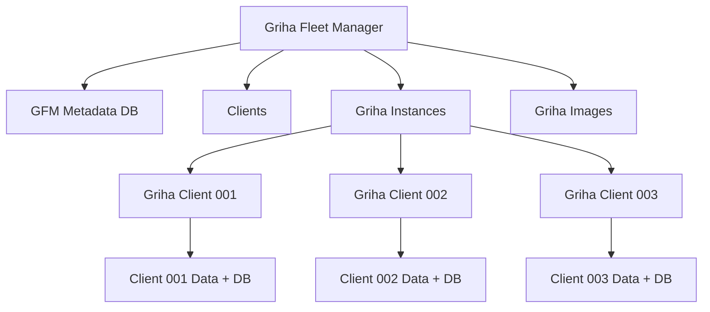
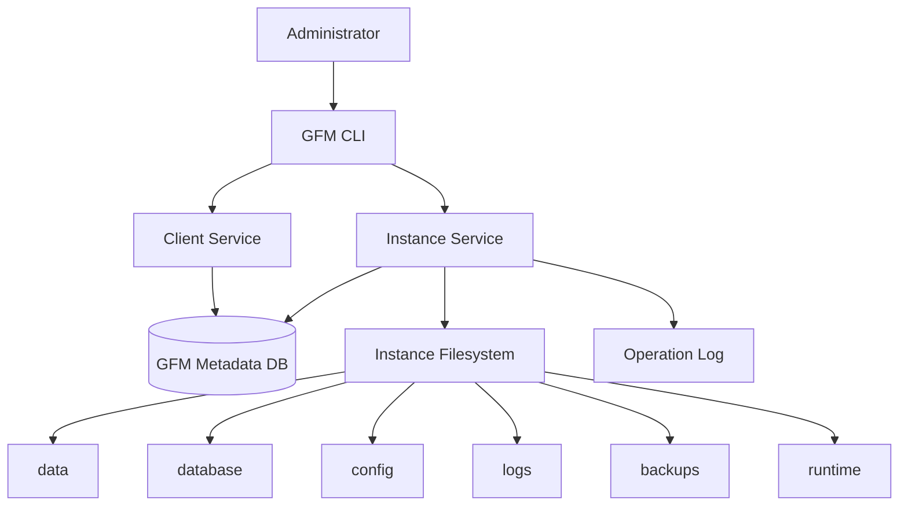
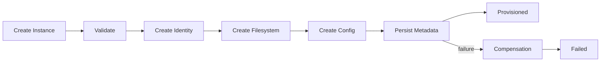

Вот здесь уже можно выбрать технологию осознанно. Я бы не выбирал Docker просто по привычке.

Для твоего сценария — один Linux-сервер, много одинаковых экземпляров Griha, отдельные данные каждого клиента, автозапуск и управление через Linux — я бы выбрал Podman + Quadlet + systemd.

Почему:

Podman daemonless — для постоянной работы не нужен отдельный центральный Docker daemon.
Поддерживает OCI-образы и стандартный контейнерный формат, поэтому мы не запираемся в какой-то экзотической технологии.
Rootless-запуск хорошо подходит для твоего Linux-сервера.
Quadlet позволяет описывать контейнеры декларативными файлами и превращать их в обычные systemd-сервисы. Причём есть шаблоны вида foo@.container, то есть один шаблон можно использовать для множества экземпляров.
Для каждого клиента можно иметь отдельный volume, переменные окружения и экземпляр сервиса.
systemd уже является штатным менеджером сервисов Linux, поэтому вместо дополнительного менеджера контейнеров получаем довольно чистую схему.

Получается примерно так:                     Linux
                      │
                    systemd
                      │
                 Podman + Quadlet
                      │
             Griha image: v1.0
                      │
       ┌──────────────┼──────────────┐
       │              │              │
       ▼              ▼              ▼
   griha@001      griha@002      griha@003
       │              │              │
     DB-001         DB-002         DB-003
       │              │              │
   volume-001     volume-002     volume-003 Причём можно сделать один шаблон: griha@.container а запускать: griha@client001
griha@client002
griha@client003
... Quadlet официально поддерживает такие template-инстансы и генерирует соответствующие systemd units.

А Docker тогда зачем?

Docker тоже прекрасно решит задачу. Я бы выбрал его, если тебе важнее максимальная распространённость и привычный docker compose.

Но конкретно для твоей задумки:

Linux → systemd → Podman → Quadlet → одинаковые Griha-контейнеры

выглядит очень естественно.

И ещё важный момент: TypeScript здесь вообще не определяет выбор контейнерного движка. Griha остаётся обычным TypeScript-приложением. Контейнеру всё равно, Node.js там внутри, Go или что-то другое.

Поэтому сейчас я бы не давал DeepSeek промпт на изменение Griha. Следующий промпт должен быть исключительно на проектирование и реализацию deployment-слоя Podman/Quadlet для существующего Griha, причём сначала пусть он изучит фактический package.json, способ запуска Node/TypeScript, БД и текущие конфиги, а уже потом создаёт Containerfile, Quadlet-шаблоны, volumes и схему запуска.

Сейчас проверю. Вот здесь. Я бы не выбирал Docker просто по привычке. Для твоего сценария на одном Linux-сервере, с изолированными инстансами Griha и отдельными БД, очень естественно ляжет связка системд, подмен и Quadlet. Quadlet умеет шаблоны для множества инстансов, типа griha@.container, и запускать, например, griha@client001, 002 и так далее, каждому свой volume, свои переменные окружения и своя БД. Docker, конечно, тоже сработает, но для твоей задачи связка Podman плюс Quadlet плюс systemd на Linux зачастую проще в обслуживании, а TypeScript-код Griha при этом не трогаем. Да, спокойно объясняю. Базовая идея такая. Сам проект Griha не меняем. Мы просто упаковываем его в контейнер, чтобы можно было запускать много одинаковых копий параллельно. У каждой копии своя база данных и свой каталог с данными, чтобы клиенты были полностью разделены. Для запуска на линуксе удобно использовать Podman вместе с Quadlet и systemd. Это позволяет описывать контейнеры как обычные сервисы systemd, делать шаблоны инстансов, например, griha@. container, и запускать нескольких клиентов независимо. У каждого будет свой volume, свои настройки и свои переменные. Docker тоже может это сделать, но Podman интегрируется с systemd более нативно, без отдельного демона и подходит для rootless-режима, что упрощает обслуживание на твоём сервере. То есть мы берём существующий Griha, делаем контейнерный образ, настраиваем шаблон Quadlet, чтобы поднимать, например, griha@client001, griha@client002 и так далее, и каждому выдаём свой отдельный volume Так каждый клиент учится только на своих данных, не смешивая всё в одну кучу, а развёртывать и обновлять такие инстансы можно командами systemd, без вмешательства в исходный TypeScript код Угу. Хороший вопрос. Здесь как раз проявляется плюс такой схемы. Исходный код Griha обновляется один раз: собираем новый образ griha:1.2.0, а потом говорим системе поднять все инстансы на этой версии. Данные клиентов лежат вне контейнеров в своих volumes, поэтому обновление или откат — это просто пересоздание контейнеров с другой версией образа. При желании можно сделать скрипт обновления всех инстансов, чтобы не выполнять кучу команд вручную. И для такой задачи Kubernetes точно не нужен. Один Linux-сервер, Podman, Quadlet и systemd вполне достаточно, чтобы управлять множеством изолированных инстансов Griha, обновлять, перезапускать и при необходимости откатывать версию.Хорошо, начинаю собирать структуру.

Да. Я бы сразу сделал структуру Griha Fleet Manager с учётом реального Griha: это сейчас npm-workspaces/Turbo-монорепозиторий, поэтому GFM логично тоже сделать TypeScript-проектом, но отдельным репозиторием. griha-fleet-manager/
│
├── README.md
├── package.json
├── package-lock.json
├── tsconfig.json
├── turbo.json
├── .gitignore
├── .env.example
│
├── apps/
│   └── gfm/
│       ├── package.json
│       └── src/
│           ├── main.ts
│           │
│           ├── cli/
│           │   ├── commands/
│           │   │   ├── client.ts
│           │   │   ├── image.ts
│           │   │   ├── deploy.ts
│           │   │   ├── update.ts
│           │   │   ├── rollback.ts
│           │   │   ├── backup.ts
│           │   │   ├── logs.ts
│           │   │   ├── monitor.ts
│           │   │   └── system.ts
│           │   └── index.ts
│           │
│           ├── api/
│           │   ├── server.ts
│           │   └── routes/
│           │
│           └── services/
│               ├── client-service.ts
│               ├── deployment-service.ts
│               ├── update-service.ts
│               ├── backup-service.ts
│               ├── migration-service.ts
│               ├── monitoring-service.ts
│               └── rollback-service.ts
│
├── packages/
│   │
│   ├── domain/
│   │   └── src/
│   │       ├── client.ts
│   │       ├── deployment.ts
│   │       ├── image.ts
│   │       ├── backup.ts
│   │       ├── migration.ts
│   │       ├── operation.ts
│   │       └── health.ts
│   │
│   ├── database/
│   │   └── src/
│   │       ├── client.ts
│   │       ├── migrations/
│   │       └── repositories/
│   │           ├── clients.ts
│   │           ├── deployments.ts
│   │           ├── images.ts
│   │           ├── backups.ts
│   │           ├── migrations.ts
│   │           └── operations.ts
│   │
│   ├── podman/
│   │   └── src/
│   │       ├── podman.ts
│   │       ├── containers.ts
│   │       ├── images.ts
│   │       ├── volumes.ts
│   │       ├── networks.ts
│   │       └── exec.ts
│   │
│   ├── systemd/
│   │   └── src/
│   │       ├── systemctl.ts
│   │       ├── quadlet.ts
│   │       └── units.ts
│   │
│   ├── deployment/
│   │   └── src/
│   │       ├── planner.ts
│   │       ├── executor.ts
│   │       ├── strategy.ts
│   │       ├── verifier.ts
│   │       └── rollback.ts
│   │
│   ├── migrations/
│   │   └── src/
│   │       ├── runner.ts
│   │       ├── version.ts
│   │       ├── backup-before-migration.ts
│   │       └── verifier.ts
│   │
│   ├── monitoring/
│   │   └── src/
│   │       ├── health.ts
│   │       ├── resources.ts
│   │       ├── container.ts
│   │       ├── database.ts
│   │       └── alerts.ts
│   │
│   └── logging/
│       └── src/
│           ├── container-logs.ts
│           ├── operation-logs.ts
│           └── audit.ts
│
├── templates/
│   ├── quadlet/
│   │   └── griha@.container
│   │
│   ├── environment/
│   │   └── client.env.template
│   │
│   └── systemd/
│       └── README.md
│
├── scripts/
│   ├── bootstrap.sh
│   ├── build-griha-image.sh
│   ├── create-client.sh
│   ├── update-client.sh
│   ├── update-all.sh
│   ├── rollback-client.sh
│   ├── backup-client.sh
│   └── health-check.sh
│
├── config/
│   ├── manager.yaml
│   └── clients/
│       └── .gitkeep
│
├── data/
│   └── .gitkeep
│
├── backups/
│   └── .gitkeep
│
├── logs/
│   └── .gitkeep
│
└── tests/
    ├── unit/
    ├── integration/
    ├── podman/
    ├── deployment/
    ├── migration/
    ├── backup/
    ├── rollback/
    └── monitoring/А теперь самое главное — разделение данных

У самого Fleet Manager будет своя небольшая БД: GFM database
│
├── clients
├── images
├── deployments
├── migrations
├── backups
├── operations
└── health_checks /var/lib/griha/
│
├── client001/
│   ├── database/
│   ├── data/
│   ├── logs/
│   └── ...
│
├── client002/
│   ├── database/
│   ├── data/
│   ├── logs/
│   └── ...
│
└── client003/
    ├── database/
    ├── data/
    ├── logs/
    └── ... То есть GFM знает, где находится клиент, какой образ он использует, какая версия БД, когда последний backup и состояние контейнера — но не владеет внутренними данными Griha.

Обновление будет выглядеть так                     Griha source
                         │
                         ▼
                 Container image
                    1.5.0
                         │
                         ▼
              ┌──────────────────┐
              │ GFM Update Engine │
              └────────┬─────────┘
                       │
          ┌────────────┼────────────┐
          ▼            ▼            ▼
       client001    client002    client003
          │            │            │
       backup       backup       backup
          │            │            │
      migration    migration    migration
          │            │            │
       deploy       deploy       deploy
          │            │            │
      health OK    health OK    health OK И GFM это сохранит в журнале операции.

Команды

В итоге управление будет примерно таким: gfm client list
gfm client create client001
gfm client start client001
gfm client stop client001
gfm client restart client001

gfm status
gfm status client001

gfm logs client001
gfm logs client001 --follow

gfm backup client001

gfm update client001 1.5.0
gfm update --all 1.5.0

gfm rollback client001

gfm migration status
gfm monitor И я бы не начинал пока писать сам код GFM. Следующий правильный этап — зафиксировать архитектурный контракт: что именно GFM получает от Griha, где находятся его БД/данные, как Griha сообщает версию схемы, какой командой запускается, какой health-check использовать и как выглядит миграция.

После этого уже можно дать DeepSeek один подробный промт на создание всего Griha Fleet Manager, причём с жёстким требованием: не менять архитектуру и learning Griha, а только сделать слой управления его контейнерными экземплярами.

Да. Я бы сразу сделал структуру Griha Fleet Manager отдельным репозиторием на TypeScript, потому что текущий Griha использует npm workspaces/Turbo monorepo. Структура такая: отдельное приложение Gri ha Fleet Manager. У него есть: своя база метад анных (к лиенты, об разы, деплой менты, мигра ции, бэ капы, операции), но данные самих Gri ha туда не попадают, у каждого клиента свои каталоги. Обнов ление выглядит как орк естра ция: новый образ Gri ha, GFM последовательно бэ капит, мигр ирует, депло ит и проверяет health-check каждого инстан са. Да. Начинаем с самого верха схемы — не с Podman и не с обновлений, а с фундаментального слоя: сам проект Griha Fleet Manager и его доменная модель.

Я посмотрел структуру текущего Griha: он действительно TypeScript, npm workspaces + Turbo, а основной агент использует better-sqlite3. Поэтому первое задание DeepSeek должно сначала создать каркас GFM и его доменные типы, не пытаясь пока управлять контейнерами. Это важно: сначала фиксируем модель того, чем Fleet Manager вообще управляет, а уже потом подключаем Podman/systemd.

Я бы разбил всю работу на последовательность промптов:                  GRIHA FLEET MANAGER
                         │
                         ▼
              ┌─────────────────────┐
              │  1. FOUNDATION      │  ← начинаем здесь
              │  структура проекта  │
              │  доменные типы      │
              │  конфигурация       │
              │  GFM database       │
              └──────────┬──────────┘
                         │
                         ▼
              ┌─────────────────────┐
              │  2. INSTANCE        │
              │  создание клиентов  │
              │  volumes/config     │
              └──────────┬──────────┘
                         │
                         ▼
              ┌─────────────────────┐
              │  3. PODMAN          │
              │  containers/images  │
              │  volumes/networks   │
              └──────────┬──────────┘
                         │
                         ▼
              ┌─────────────────────┐
              │  4. SYSTEMD/QUADLET │
              │  запуск/автозапуск  │
              └──────────┬──────────┘
                         │
                         ▼
              ┌─────────────────────┐
              │  5. DEPLOYMENT      │
              │  обновление Griha   │
              └──────────┬──────────┘
                         │
                         ▼
              ┌─────────────────────┐
              │  6. MIGRATIONS      │
              │  изменение БД       │
              └──────────┬──────────┘
                         │
                         ▼
              ┌─────────────────────┐
              │  7. BACKUP/ROLLBACK │
              └──────────┬──────────┘
                         │
                         ▼
              ┌─────────────────────┐
              │  8. MONITORING/LOGS │
              └─────────────────────┘ Первый промпт я бы сделал именно таким — фундаментальным. Он не должен сразу писать весь GFM. Его задача — создать правильный скелет и доменную модель. # Griha Fleet Manager — Prompt 01

## Foundation, структура проекта и доменная модель

Ты разрабатываешь новый отдельный проект **Griha Fleet Manager (GFM)**.

GFM — это отдельная система управления множеством независимых экземпляров проекта Griha AI, работающих на одном Linux-сервере.

## 1. Главная архитектурная идея

Существует уже готовый проект Griha AI.

Griha НЕ нужно переписывать.

Griha НЕ нужно переделывать в multi-tenant application.

Griha НЕ нужно объединять базы разных клиентов.

Griha НЕ нужно переносить learning-механику в GFM.

Griha остаётся самостоятельным приложением.

GFM должен управлять жизненным циклом отдельных экземпляров Griha:

```text
                         Griha Fleet Manager
                                  │
             ┌────────────────────┼────────────────────┐
             │                    │                    │
             ▼                    ▼                    ▼
        Instances              Images              Operations
             │                    │                    │
             └────────────────────┼────────────────────┘
                                  │
                                  ▼
                              Podman
                                  │
                  ┌───────────────┼───────────────┐
                  ▼               ▼               ▼
              Griha-001       Griha-002       Griha-003
                  │               │               │
                  ▼               ▼               ▼
               Data 001        Data 002        Data 003
               DB 001          DB 002          DB 003
```

Каждый экземпляр Griha должен быть полностью независимым с точки зрения:

* конфигурации;
* persistent data;
* базы данных;
* Telegram-конфигурации;
* learning state;
* observability data;
* credentials/secrets;
* lifecycle;
* версии приложения.

Общий только container image и инфраструктурные ресурсы Linux-сервера.

---

# 2. ВАЖНО: сначала изучи существующий Griha

Перед созданием файлов GFM обязательно изучи существующий репозиторий Griha.

Нужно проверить минимум:

* root `package.json`;
* `turbo.json`;
* `apps/agent/package.json`;
* способ запуска Griha;
* способ сборки Griha;
* Node.js requirements;
* npm version;
* TypeScript configuration;
* текущую структуру SQLite;
* существующие database migrations, если они уже есть;
* существующий observability;
* существующий self-update;
* существующие configuration/environment variables;
* расположение persistent data;
* существующие тесты.

Текущий Griha — TypeScript-проект с npm workspaces/Turbo.

Основной agent package использует:

```text
better-sqlite3
```

Не предполагай структуру базы данных, если её можно проверить в исходниках.

Не создавай вторую систему хранения данных Griha только потому, что она кажется удобной.

GFM может иметь свою отдельную metadata database, но эта БД предназначена только для управления экземплярами и НЕ является базой данных самого Griha.

---

# 3. Что создаём в этом промпте

В рамках первого этапа создай только Foundation.

Нужно создать:

```text
griha-fleet-manager/
│
├── README.md
├── package.json
├── package-lock.json
├── tsconfig.json
├── turbo.json
├── .gitignore
├── .env.example
│
├── apps/
│   └── gfm/
│       ├── package.json
│       └── src/
│           └── main.ts
│
├── packages/
│   ├── domain/
│   │   └── src/
│   └── database/
│       └── src/
│
├── config/
│   └── manager.example.yaml
│
└── tests/
```

Не реализовывай пока:

* Podman;
* Quadlet;
* systemd;
* создание контейнеров;
* обновление контейнеров;
* migration runner Griha;
* backup engine;
* rollback engine;
* monitoring engine.

Сейчас создаётся фундамент, на который эти подсистемы будут добавлены последующими этапами.

---

# 4. Почему GFM должен иметь собственную БД

GFM должен хранить metadata о своей инфраструктуре.

Например:

```text
GFM database
│
├── clients
├── instances
├── images
├── deployments
├── migrations
├── backups
├── operations
└── health_checks
```

Но:

```text
GFM database
        X
        │
        X
не хранит внутреннюю БД Griha клиента
```

Данные Griha находятся отдельно:

```text
/var/lib/griha/
│
├── client-001/
│   ├── database/
│   ├── data/
│   ├── obs/
│   └── ...
│
├── client-002/
│   ├── database/
│   ├── data/
│   ├── obs/
│   └── ...
```

GFM хранит только ссылки/метаданные:

```text
instance_id
client_id
data_path
database_path
container_name
image_version
database_schema_version
status
```

---

# 5. Доменная модель

Создай строгие TypeScript-типы.

Не использовать `any`.

Предпочтительно использовать:

* `type`;
* `interface`;
* discriminated unions;
* branded types там, где они реально повышают безопасность;
* readonly поля для immutable domain data.

Не превращай проект в чрезмерно сложную архитектуру.

Нужна простая и проверяемая domain layer.

---

# 6. Client

Создай тип клиента.

Пример концепции:

```ts
type ClientId = string;

interface Client {
  readonly id: ClientId;
  readonly name: string;
  readonly createdAt: string;
  readonly updatedAt: string;
  readonly status: ClientStatus;
}
```

Статусы должны быть ограниченным набором.

Например:

```ts
type ClientStatus =
  | "active"
  | "suspended"
  | "archived";
```

Не используй произвольные строки там, где существует конечный набор состояний.

Объясни в документации, почему используется union type.

---

# 7. Griha Instance

Это один из центральных объектов GFM.

Создай:

```ts
type InstanceId = string;

interface GrihaInstance {
  readonly id: InstanceId;
  readonly clientId: ClientId;
  readonly name: string;

  readonly containerName: string;

  readonly imageId: ImageId;
  readonly imageVersion: string;

  readonly databaseSchemaVersion: number;

  readonly status: InstanceStatus;

  readonly dataPath: string;
  readonly databasePath: string;

  readonly createdAt: string;
  readonly updatedAt: string;
}
```

Статус сделать ограниченным:

```ts
type InstanceStatus =
  | "provisioning"
  | "stopped"
  | "starting"
  | "running"
  | "stopping"
  | "updating"
  | "failed"
  | "rollback"
  | "archived";
```

Проверь, действительно ли каждый статус нужен.

Если меняешь список — объясни почему.

---

# 8. Container Image

Создай доменную сущность образа.

Например:

```ts
type ImageId = string;

interface GrihaImage {
  readonly id: ImageId;
  readonly repository: string;
  readonly version: string;
  readonly digest: string;
  readonly createdAt: string;
  readonly status: ImageStatus;
}
```

Статус:

```ts
type ImageStatus =
  | "available"
  | "deprecated"
  | "invalid";
```

Важно:

`version` и `digest` — разные понятия.

Version отвечает за логическую версию приложения.

Digest идентифицирует конкретный image content.

Не считать tag/version достаточным immutable identifier.

---

# 9. Deployment

Deployment должен описывать попытку изменить версию экземпляра.

Создай:

```ts
interface Deployment {
  readonly id: string;
  readonly instanceId: InstanceId;

  readonly fromVersion: string | null;
  readonly toVersion: string;

  readonly status: DeploymentStatus;

  readonly startedAt: string;
  readonly finishedAt: string | null;

  readonly errorCode: string | null;
  readonly errorMessage: string | null;
}
```

Статус:

```ts
type DeploymentStatus =
  | "planned"
  | "running"
  | "succeeded"
  | "failed"
  | "rolled_back"
  | "cancelled";
```

Deployment должен быть исторической записью.

Не перезаписывай старый deployment при следующем обновлении.

---

# 10. Database Migration

Создай отдельную domain model для миграций.

```ts
interface DatabaseMigration {
  readonly id: string;
  readonly instanceId: InstanceId;

  readonly fromVersion: number;
  readonly toVersion: number;

  readonly status: MigrationStatus;

  readonly backupId: string | null;

  readonly startedAt: string;
  readonly finishedAt: string | null;

  readonly errorCode: string | null;
  readonly errorMessage: string | null;
}
```

Статус:

```ts
type MigrationStatus =
  | "planned"
  | "running"
  | "succeeded"
  | "failed"
  | "rolled_back";
```

Критически важно:

GFM должен знать версию schema каждого экземпляра.

Но НЕ придумывай механизм миграции Griha на этом этапе.

Сначала исследуй существующую систему Griha.

Если в Griha уже существует механизм migration/versioning — GFM должен будет интегрироваться с ним в будущем.

Если его нет — это будет отдельный архитектурный этап.

---

# 11. Backup

Создай domain model backup.

```ts
interface Backup {
  readonly id: string;
  readonly instanceId: InstanceId;

  readonly type: BackupType;

  readonly sourceVersion: number;

  readonly path: string;

  readonly sizeBytes: number;

  readonly checksum: string;

  readonly status: BackupStatus;

  readonly createdAt: string;
}
```

Типы:

```ts
type BackupType =
  | "pre_migration"
  | "manual"
  | "scheduled";
```

Статусы:

```ts
type BackupStatus =
  | "creating"
  | "ready"
  | "failed"
  | "deleted";
```

Не хранить binary backup внутри metadata database.

Metadata database хранит только metadata и path/reference.

---

# 12. Operation

GFM должен иметь журнал собственных операций.

Создай:

```ts
interface Operation {
  readonly id: string;

  readonly type: OperationType;

  readonly targetInstanceId: InstanceId | null;

  readonly status: OperationStatus;

  readonly startedAt: string;
  readonly finishedAt: string | null;

  readonly errorCode: string | null;
  readonly errorMessage: string | null;
}
```

Типы:

```ts
type OperationType =
  | "create_instance"
  | "start_instance"
  | "stop_instance"
  | "restart_instance"
  | "update_instance"
  | "update_all"
  | "backup"
  | "migration"
  | "rollback"
  | "delete_instance"
  | "health_check";
```

---

# 13. Health Check

Создай domain model для состояния экземпляра.

Например:

```ts
interface HealthCheck {
  readonly id: string;
  readonly instanceId: InstanceId;

  readonly status: HealthStatus;

  readonly checkedAt: string;

  readonly responseTimeMs: number | null;

  readonly errorCode: string | null;
  readonly errorMessage: string | null;
}
```

Статусы:

```ts
type HealthStatus =
  | "healthy"
  | "unhealthy"
  | "unknown";
```

Не считать `container running` автоматически равным `Griha healthy`.

Это два разных состояния.

Контейнер может работать, а приложение внутри него — не отвечать.

---

# 14. Repository interfaces

В этом этапе можно создать интерфейсы repository.

Например:

```ts
interface InstanceRepository {
  getById(id: InstanceId): Promise<GrihaInstance | null>;

  list(): Promise<readonly GrihaInstance[]>;

  create(instance: GrihaInstance): Promise<void>;

  update(instance: GrihaInstance): Promise<void>;
}
```

Аналогично:

```text
ClientRepository
InstanceRepository
ImageRepository
DeploymentRepository
MigrationRepository
BackupRepository
OperationRepository
HealthCheckRepository
```

ВАЖНО:

Repository interfaces находятся в domain/application boundary.

Конкретная SQLite реализация будет находиться в database package.

То есть:

```text
domain
   │
   │ interfaces
   ▼
database
   │
   │ SQLite implementation
   ▼
better-sqlite3
```

Не наоборот.

---

# 15. Database package

Для metadata database GFM используй SQLite, если после анализа требований нет объективной причины использовать другую БД.

Причины:

1. GFM работает на одном Linux-сервере.
2. Это локальная metadata database.
3. Не нужен отдельный database server.
4. Простое резервное копирование.
5. Хорошо подходит для небольшого объёма metadata.
6. В существующем Griha уже используется `better-sqlite3`.

Но НЕ смешивай:

```text
Griha SQLite
```

и

```text
GFM SQLite
```

Это две разные базы с разными жизненными циклами.

---

# 16. Database schema

Создай первую схему GFM metadata database.

Минимальные таблицы:

```text
clients
instances
images
deployments
database_migrations
backups
operations
health_checks
```

Все таблицы должны иметь:

* primary key;
* необходимые foreign keys;
* NOT NULL там, где значение обязательно;
* CHECK constraints для enum-подобных полей, если это уместно;
* индексы для часто используемых foreign keys;
* timestamps.

Foreign key integrity должна быть включена.

---

# 17. Migration system самого GFM

Разделяй:

```text
GFM metadata migrations
```

и:

```text
Griha client database migrations
```

Это принципиально разные вещи.

Например:

```text
GFM DB migration
   ↓
изменение таблицы instances
```

не имеет отношения к:

```text
Griha DB migration
   ↓
изменение database schema клиента
```

В этом этапе реализуй только основу для миграций собственной GFM database.

Миграции клиентской БД Griha НЕ реализовывать.

---

# 18. IDs

Не используй случайные числовые IDs без причины.

Для доменных сущностей используй UUID/строковые идентификаторы либо другой явно обоснованный формат.

Для каждого ID должна существовать отдельная type alias:

```ts
type ClientId = string;
type InstanceId = string;
type ImageId = string;
type DeploymentId = string;
type BackupId = string;
type OperationId = string;
```

Это позволит избежать случайной передачи:

```ts
clientId
```

в функцию, которая ожидает:

```ts
instanceId
```

Если TypeScript-структура позволяет сделать branded IDs — оцени использование branded types.

---

# 19. Время

Не использовать `Date` непосредственно в database model без необходимости.

Для persisted timestamps предпочтительно использовать ISO-8601 UTC strings либо другой единообразный формат.

Например:

```text
2026-09-25T06:00:00.000Z
```

Все persisted timestamps должны быть в UTC.

Локальный часовой пояс используется только на уровне отображения.

---

# 20. Ошибки

Не использовать повсеместно:

```ts
throw new Error("something went wrong")
```

Создай базовую структуру domain/application errors.

Например:

```ts
class GfmError extends Error {
  readonly code: string;
  readonly cause?: unknown;

  constructor(
    code: string,
    message: string,
    cause?: unknown,
  ) {
    super(message);
    this.name = "GfmError";
    this.code = code;
    this.cause = cause;
  }
}
```

Добавь специализированные ошибки только там, где они реально нужны.

Не создавай десятки классов ошибок без необходимости.

---

# 21. Configuration

Создай конфигурационную модель GFM.

Минимально должны быть предусмотрены:

```text
GFM_DATA_DIR
GFM_DATABASE_PATH
GFM_GRIHA_DATA_ROOT
GFM_BACKUP_ROOT
GFM_LOG_DIR
GFM_IMAGE_REPOSITORY
```

Но перед финальным именованием переменных проверь существующие conventions Griha.

Configuration должна быть централизованной.

Не читать `process.env` по всему проекту.

Правильно:

```text
process.env
     ↓
config loader
     ↓
validated Config
     ↓
application
```

Используй schema validation.

Для этого можно использовать Zod, если он уже соответствует принятому стеку.

---

# 22. Что должно быть в README

README первого этапа должен объяснить:

1. Что такое GFM.
2. Зачем он существует.
3. Чем GFM отличается от Griha.
4. Что является instance.
5. Что является client.
6. Где находится GFM metadata database.
7. Где находятся данные Griha.
8. Почему базы клиентов не объединяются.
9. Почему SQLite используется для metadata.
10. Как устроена domain model.
11. Какие части пока НЕ реализованы.
12. Roadmap следующих этапов.

Добавь диаграмму Mermaid:



---

# 23. Тесты первого этапа

Пока не тестируй Podman.

Тестируй domain model и metadata database.

Обязательно:

### Client

* создание клиента;
* получение клиента;
* список клиентов;
* изменение статуса;
* отсутствие дубликатов ID.

### Instance

* создание instance;
* связь instance → client;
* получение instance;
* изменение состояния;
* невозможность создать instance с несуществующим client.

### Image

* регистрация image;
* version;
* digest;
* поиск image.

### Deployment

* создание deployment;
* переходы состояний;
* сохранение failed deployment;
* сохранение rollback status.

### Migration

* регистрация migration;
* version from/to;
* backup reference;
* failed migration.

### Backup

* metadata backup;
* checksum;
* size;
* status.

### Operation

* audit trail;
* success;
* failure.

### Database

Проверить:

```text
foreign keys
unique constraints
indexes
transactions
rollback transaction
```

---

# 24. Транзакции

Все операции, изменяющие несколько связанных таблиц, должны использовать transaction.

Например:

```text
create instance
    ↓
insert instance
    ↓
insert operation
    ↓
commit
```

Если второй INSERT упал:

```text
ROLLBACK
```

Нельзя оставлять GFM database в частично изменённом состоянии.

---

# 25. Что НЕ делать

Это обязательная часть задания.

НЕ:

* переписывать Griha;
* менять learning;
* менять memory;
* менять Telegram;
* менять runtime;
* переносить Griha database в GFM;
* создавать multi-tenant database;
* добавлять Kubernetes;
* добавлять Docker Compose без необходимости;
* создавать Podman integration на этом этапе;
* создавать systemd units на этом этапе;
* создавать Quadlet units на этом этапе;
* писать deployment engine на этом этапе;
* реализовывать migration Griha на этом этапе;
* придумывать API Griha, которого нет;
* использовать `any`;
* скрывать ошибки через `catch {}` без обработки;
* создавать ненужную абстракцию ради абстракции.

---

# 26. Критерии готовности

Этап считается завершённым только если:

```text
npm install
      ↓
npm run typecheck
      ↓
npm test
      ↓
npm run build
```

проходят успешно.

Дополнительно:

```text
npm run lint
```

должен проходить без новых ошибок.

Все созданные domain types должны использоваться либо иметь явно объяснённое назначение.

GFM должен запускаться даже без Podman.

Это важно: Foundation не должен зависеть от наличия контейнерного runtime.

---

# 27. Финальный отчёт DeepSeek

После реализации НЕ ограничивайся сообщением "готово".

Верни подробный отчёт:

```text
1. Что изучено в существующем Griha
2. Какие архитектурные решения приняты
3. Какие файлы созданы
4. Какие файлы изменены
5. Какие domain entities добавлены
6. Какая схема GFM database создана
7. Какие constraints/indexes добавлены
8. Какие repository interfaces созданы
9. Какие ошибки предусмотрены
10. Какие тесты добавлены
11. Какие команды проверки выполнены
12. Результаты typecheck
13. Результаты tests
14. Результаты build
15. Результаты lint
16. Что намеренно НЕ реализовано
17. Какие вопросы остаются для Prompt 02
```

Особенно важно отдельно написать:

```text
Griha source code changed: YES/NO
Griha learning changed: YES/NO
Griha database changed: YES/NO
```

Если какой-либо файл самого Griha пришлось изменить — указать точный файл, конкретное изменение и почему без него невозможно было продолжить.

---

# 28. Главный принцип

На этом этапе мы строим фундамент:

```text
                    GFM
                     │
        ┌────────────┼────────────┐
        ▼            ▼            ▼
      Client      Instance       Image
        │            │            │
        └────────────┼────────────┘
                     ▼
                Deployment
                     │
          ┌──────────┼──────────┐
          ▼          ▼          ▼
      Migration    Backup    Operation
                     │
                     ▼
                HealthCheck
```

Но пока это только **доменная модель и metadata layer**.

Инфраструктура будет подключаться следующим этапом:

```text
Foundation
    ↓
Instance provisioning
    ↓
Podman
    ↓
Quadlet + systemd
    ↓
Deployment
    ↓
Migration
    ↓
Backup / Rollback
    ↓
Monitoring / Logs
```

Не перескакивай через этапы.

Сначала сделай этот Foundation качественно и проверь его тестами.
# Griha Fleet Manager — Prompt 02

## Onboarding клиента и создание управляемого экземпляра Griha

Ты продолжаешь разработку **Griha Fleet Manager (GFM)**.

В предыдущем этапе был создан фундамент проекта:

```text
Griha Fleet Manager
        │
        ├── Domain
        ├── Metadata Database
        ├── Repository interfaces
        ├── Configuration
        └── Tests
```

Теперь реализуется следующий слой:

```text
                 GFM
                  │
                  ▼
          Instance Provisioning
                  │
        ┌─────────┼─────────┐
        ▼         ▼         ▼
     Client    Instance    Config
        │         │          │
        └─────────┼──────────┘
                  ▼
            Instance Layout
                  │
        ┌─────────┼─────────┐
        ▼         ▼         ▼
      Data       DB       Config
                  │
                  ▼
            Ready Instance
```

## ГЛАВНОЕ ПРАВИЛО

На этом этапе **не реализовывать Podman, systemd, Quadlet, запуск контейнера и deployment engine**.

Мы пока создаём правильный управляемый экземпляр на уровне файловой системы, конфигурации и metadata GFM.

После этого следующим этапом инфраструктурный слой сможет взять уже созданный instance и запустить его.

---

# 1. Сначала повторно изучи существующий Griha

Перед написанием кода снова изучи актуальное состояние репозитория Griha.

Не полагайся на предположения из предыдущего промпта.

Проверь:

```text
root package.json
turbo.json
workspace structure
apps/agent
agent package.json
runtime entrypoint
environment variables
configuration files
SQLite paths
persistent directories
Telegram configuration
learning/memory directories
logs
```

Особенно важно определить:

```text
Какие файлы Griha действительно обязательны для запуска?
Какие каталоги являются persistent?
Какие каталоги можно создавать пустыми?
Какие environment variables обязательны?
Какие значения генерируются при первом запуске?
Где физически находится SQLite database?
```

Если существующая архитектура Griha отличается от предположений предыдущего промпта, **адаптируй GFM под реальную архитектуру Griha**, а не наоборот.

GFM не должен заставлять Griha менять свою внутреннюю архитектуру.

---

# 2. Цель этого этапа

После выполнения Prompt 02 GFM должен уметь логически выполнить:

```text
Create Client
      │
      ▼
Create Instance
      │
      ▼
Validate Instance Name
      │
      ▼
Allocate Instance ID
      │
      ▼
Create directory structure
      │
      ├── data/
      ├── database/
      ├── config/
      ├── logs/
      ├── backups/
      └── runtime/
      │
      ▼
Create initial configuration
      │
      ▼
Register instance in GFM metadata DB
      │
      ▼
Create operation record
      │
      ▼
Instance = provisioned
```

Но:

```text
provisioned
```

не означает:

```text
running
```

И тем более:

```text
healthy
```

Это принципиальное разделение.

---

# 3. Новая архитектура состояния

Добавь/уточни состояния instance.

Если в Prompt 01 были:

```ts
"provisioning"
"stopped"
"starting"
"running"
"stopping"
"updating"
"failed"
"rollback"
"archived"
```

проверь необходимость отдельного состояния:

```ts
"provisioned"
```

Рекомендуемая модель:

```text
                         ┌───────────────┐
                         │ provisioning  │
                         └───────┬───────┘
                                 │
                                 ▼
                         ┌───────────────┐
                         │  provisioned  │
                         └───────┬───────┘
                                 │
                                 ▼
                         ┌───────────────┐
                         │    stopped    │
                         └───────┬───────┘
                                 │
                                 ▼
                         ┌───────────────┐
                         │   starting    │
                         └───────┬───────┘
                                 │
                                 ▼
                         ┌───────────────┐
                         │    running    │
                         └───────────────┘
```

Проверь, нужен ли `provisioned` отдельно от `stopped`.

Если да — объясни это в документации.

---

# 4. Client onboarding

Создай application service:

```text
ClientService
```

или аналогичное название согласно существующей архитектуре.

Он должен уметь:

```ts
createClient()
getClient()
listClients()
updateClient()
archiveClient()
```

Минимальная команда создания:

```ts
CreateClientInput
```

Например:

```ts
interface CreateClientInput {
  readonly name: string;
}
```

Не принимай:

```text
id
createdAt
updatedAt
```

от пользователя.

Эти значения генерирует GFM.

---

# 5. Валидация Client

Имя клиента должно:

* быть непустым;
* быть нормализовано;
* иметь разумное ограничение длины;
* не содержать управляющих символов;
* не использоваться непосредственно как путь filesystem;
* не позволять path traversal.

Например:

```text
../../etc
```

должно быть недопустимо как filesystem identifier.

ВАЖНО:

Название клиента и filesystem slug — разные вещи.

Например:

```text
name:
ООО Ромашка

slug:
ooo-romashka
```

Но slug не должен молча заменять исходное название клиента.

В metadata должны храниться оба значения, если это действительно необходимо.

---

# 6. Instance creation

Создай application service:

```text
InstanceService
```

или эквивалент согласно архитектуре.

Основная операция:

```ts
createInstance(input)
```

Входные данные должны содержать минимум:

```ts
interface CreateInstanceInput {
  readonly clientId: ClientId;
  readonly name: string;
}
```

Не разрешай пользователю напрямую задавать:

```text
instanceId
containerName
dataPath
databasePath
```

если для этого нет административного сценария.

Эти значения должны формироваться GFM.

---

# 7. Генерация Instance ID

Instance ID должен быть стабильным и уникальным.

Например:

```text
inst_01...
```

или UUID.

Не использовать:

```text
1
2
3
```

как единственный идентификатор.

ID должен оставаться неизменным на протяжении всего жизненного цикла instance.

Если:

```text
instance = inst_xxx
```

то после:

```text
stop
restart
update
backup
rollback
```

ID остаётся тем же.

---

# 8. Filesystem layout

Создай централизованный механизм расчёта путей.

Например:

```text
InstancePathResolver
```

Он получает:

```ts
instanceId
```

и возвращает структуру:

```text
/var/lib/griha/
└── instances/
    └── <instance-id>/
        ├── data/
        ├── database/
        ├── config/
        ├── logs/
        ├── backups/
        └── runtime/
```

Но **не копируй автоматически всю эту структуру**, пока анализ Griha не подтвердит необходимость каждого каталога.

Главный принцип:

```text
GFM owns lifecycle directories
Griha owns its internal data semantics
```

То есть GFM определяет расположение instance, но не должен без причины вмешиваться во внутреннюю структуру данных Griha.

---

# 9. Никогда не строить путь простой конкатенацией

Плохо:

```ts
`${root}/${instanceName}`
```

Нужно использовать безопасную filesystem abstraction:

```ts
path.resolve(...)
```

и дополнительно проверять:

```text
resolved path
    ↓
must remain inside configured root
```

Например:

```text
root:
 /var/lib/griha/instances

requested:
 ../../etc

result:
 /etc

=> REJECT
```

Это обязательная защита.

---

# 10. Directory ownership

Создание каталогов должно быть идемпотентным.

Повторный вызов:

```text
createInstance(inst_123)
```

не должен уничтожить существующие данные.

Нельзя делать:

```text
rm -rf instance directory
mkdir instance directory
```

при обычном onboarding.

Если instance уже существует:

```text
INSTANCE_ALREADY_EXISTS
```

---

# 11. Atomic provisioning

Создание instance должно быть максимально атомарным.

Нельзя получить ситуацию:

```text
database record exists
filesystem does not exist
```

или:

```text
filesystem exists
database record does not exist
```

Для этого используй orchestration:

```text
BEGIN operation
      │
      ▼
validate
      │
      ▼
create filesystem
      │
      ▼
create config
      │
      ▼
create metadata
      │
      ▼
COMMIT
```

Но помни:

SQLite transaction не может автоматически откатить filesystem operation.

Поэтому нужен compensating action.

Например:

```text
Filesystem created
        │
        ▼
Metadata INSERT fails
        │
        ▼
cleanup newly-created filesystem
        │
        ▼
operation = failed
```

Если cleanup тоже не удался:

```text
operation = failed
cleanupStatus = failed
```

и это должно быть явно записано в журнал.

Не скрывать такую ошибку.

---

# 12. Operation lifecycle

Создание instance должно создавать Operation.

Например:

```text
create_instance
```

Состояния:

```text
planned
   ↓
running
   ↓
succeeded
```

При ошибке:

```text
planned
   ↓
running
   ↓
failed
```

Operation должна содержать:

```text
operationId
type
targetInstanceId
startedAt
finishedAt
errorCode
errorMessage
```

Если instance ID ещё не существует в начале операции, допустимо временно иметь:

```text
targetInstanceId = null
```

или использовать отдельную correlation ID.

Выбери один подход и документируй его.

---

# 13. Initial configuration

После создания instance должен существовать начальный configuration.

Но не копируй production secrets.

Создай безопасный шаблон:

```text
config/
    instance.yaml
```

или другой формат, если он соответствует Griha.

Конфигурация должна содержать только необходимые metadata/configuration values.

Например:

```yaml
instance:
  id: inst_xxx
  clientId: client_xxx

runtime:
  environment: production

paths:
  data: ...
  database: ...
  logs: ...
```

Секреты:

```text
Telegram token
API keys
credentials
private keys
```

не должны попадать:

```text
Git
README
metadata logs
operation logs
```

и не должны случайно попадать в JSON errors.

---

# 14. Secret architecture

На этом этапе НЕ реализовывай полноценный secret manager.

Но архитектура должна оставить место для него.

Например:

```text
InstanceConfig
       │
       ├── public configuration
       │
       └── secret references
```

Вместо:

```yaml
telegramToken: "123456..."
```

может использоваться:

```yaml
telegramToken:
  source: environment
  key: GRIHA_INSTANCE_TELEGRAM_TOKEN
```

или другой механизм, который соответствует реальной инфраструктуре.

Документируй выбранный вариант.

---

# 15. Container name

Хотя Podman ещё не реализуем, будущий container name должен быть детерминированным.

Например:

```text
griha-<instance-id>
```

Но не используй display name клиента.

Плохо:

```text
griha-ООО Ромашка
```

Хорошо:

```text
griha-inst_01H...
```

Container name должен быть:

```text
unique
stable
predictable
filesystem/container-runtime safe
```

---

# 16. Instance metadata

После создания должны быть заполнены:

```text
id
clientId
name
containerName
status
dataPath
databasePath
createdAt
updatedAt
```

Если image ещё не назначается до этапа deployment — не придумывай fake image.

Лучше:

```text
imageId = null
imageVersion = null
```

если domain model это позволяет.

Если текущая модель не позволяет — исправь её.

Не использовать фиктивные значения:

```text
"unknown"
"latest"
"0.0.0"
```

только чтобы удовлетворить NOT NULL.

---

# 17. Версия Griha

При создании нового instance необходимо определить:

```text
Какая версия Griha будет установлена?
```

Но Podman/image deployment ещё не реализован.

Поэтому раздели:

```text
desiredVersion
```

и:

```text
runningVersion
```

Например:

```ts
interface InstanceVersionState {
  readonly desiredVersion: string | null;
  readonly runningVersion: string | null;
}
```

На provisioning:

```text
desiredVersion = configured/default version
runningVersion = null
```

После реального deployment:

```text
runningVersion = actual deployed version
```

Это важно для будущих обновлений.

---

# 18. Default image/version

Если GFM имеет глобальную настройку:

```text
default Griha version
```

она должна использоваться только как default.

Instance должен иметь собственное зафиксированное значение:

```text
instance desiredVersion
```

После создания изменение global default не должно автоматически менять уже существующие instances.

Пример:

```text
Global default:
v1.5.0

Instance A:
v1.5.0

Global default → v1.6.0

Instance A:
still v1.5.0
```

Новый instance:

```text
v1.6.0
```

---

# 19. Idempotency

Создание instance должно быть защищено от повторного выполнения.

Сценарий:

```text
user clicks Create
        │
        ▼
request starts
        │
        ▼
network/process interruption
        │
        ▼
user repeats request
```

GFM не должен создать два одинаковых instance.

Добавь механизм idempotency key там, где это соответствует архитектуре.

Например:

```ts
CreateInstanceCommand {
  readonly requestId: string;
  readonly clientId: ClientId;
  readonly name: string;
}
```

Если одинаковая команда уже успешно выполнена:

```text
return existing result
```

Если она находится в процессе:

```text
return operation status
```

Если предыдущая попытка завершилась ошибкой:

```text
allow retry
```

---

# 20. Concurrency

Предусмотри конкурентные вызовы:

```text
CreateInstance(A)
CreateInstance(A)
```

одновременно.

Нельзя полагаться только на:

```ts
if (!exists()) {
    create()
}
```

потому что возникает race condition:

```text
request A → exists? NO
request B → exists? NO
request A → create
request B → create
```

Используй database constraints и transaction.

Filesystem тоже должен обрабатываться безопасно.

---

# 21. Slug

Если нужен filesystem-safe slug:

```text
InstanceName
       ↓
SlugGenerator
       ↓
Filesystem-safe identifier
```

Slug должен быть:

```text
deterministic
stable
collision-safe
```

Но не использовать slug как основной identity.

Основной identity:

```text
InstanceId
```

---

# 22. Repository additions

Добавь необходимые методы:

```ts
ClientRepository
InstanceRepository
OperationRepository
```

Например:

```ts
getById()
getByClientId()
findByName()
create()
update()
```

Не добавляй методы просто "на будущее".

Каждый метод должен использоваться application layer или быть явно необходимым контрактом.

---

# 23. Filesystem abstraction

Не разрешай application service напрямую делать:

```ts
fs.mkdir(...)
fs.writeFile(...)
```

по всему проекту.

Создай abstraction:

```ts
InstanceFilesystem
```

или:

```ts
InstanceStorage
```

Например:

```ts
interface InstanceFilesystem {
  createLayout(instance: GrihaInstance): Promise<void>;

  writeInitialConfig(
    instance: GrihaInstance,
    config: InstanceConfig,
  ): Promise<void>;

  removeProvisionedLayout(
    instance: GrihaInstance,
  ): Promise<void>;
}
```

Concrete implementation находится в infrastructure layer.

---

# 24. Dry-run

Если архитектура позволяет, добавь возможность:

```text
provision --dry-run
```

которая показывает:

```text
Client
Instance ID
directories
configuration
container name
desired version
```

но ничего не изменяет.

Если CLI пока ещё не реализуется, подготовь application command так, чтобы dry-run можно было добавить без переделки доменной модели.

---

# 25. CLI

Если в Prompt 01 был предусмотрен CLI, добавь команды:

```text
gfm client create
gfm client list

gfm instance create
gfm instance get
gfm instance list
```

Пример:

```text
gfm client create "ООО Ромашка"
```

затем:

```text
gfm instance create \
  --client <client-id> \
  --name main
```

CLI не должен содержать бизнес-логику.

Правильно:

```text
CLI
 ↓
Application service
 ↓
Domain
 ↓
Repository / infrastructure
```

Неправильно:

```text
CLI
 ↓
SQLite
 ↓
fs
 ↓
business logic
```

---

# 26. Output

CLI должен возвращать machine-readable результат при необходимости.

Например:

```bash
gfm instance create ... --json
```

Результат:

```json
{
  "instanceId": "inst_...",
  "clientId": "client_...",
  "status": "provisioned",
  "operationId": "op_..."
}
```

Не помещать секреты в output.

---

# 27. Ошибки

Создай коды ошибок.

Минимально:

```text
CLIENT_NOT_FOUND
CLIENT_ARCHIVED
INSTANCE_ALREADY_EXISTS
INSTANCE_NOT_FOUND
INVALID_INSTANCE_NAME
INVALID_PATH
PATH_OUTSIDE_ROOT
FILESYSTEM_CREATE_FAILED
CONFIG_WRITE_FAILED
DATABASE_WRITE_FAILED
PROVISIONING_FAILED
CONCURRENT_OPERATION
IDEMPOTENCY_CONFLICT
```

Ошибки должны быть пригодны для:

```text
CLI
API
logs
monitoring
future Telegram/UI
```

---

# 28. Logging

Добавь структурированный logging для provisioning.

Например:

```json
{
  "level": "info",
  "event": "instance.provision.started",
  "operationId": "op_...",
  "instanceId": "inst_..."
}
```

Не логировать:

```text
tokens
passwords
API keys
private keys
secrets
```

При ошибке логировать:

```text
error code
operation id
instance id
stage
```

---

# 29. Provisioning stages

Provisioning должен иметь понятные стадии:

```text
validate
   ↓
allocate_identity
   ↓
create_directories
   ↓
create_config
   ↓
persist_metadata
   ↓
finalize
```

Если ошибка:

```text
FAILED
   ↓
cleanup
   ↓
record cleanup result
```

Стадии должны быть видны в логах.

---

# 30. Transaction boundary

Database transaction:

```text
create client
```

или:

```text
create instance metadata
```

должна использоваться там, где несколько metadata records должны появиться атомарно.

Но filesystem нельзя считать частью SQLite transaction.

Документируй:

```text
Database transaction
+
Filesystem compensation
```

как две разные механики согласованности.

---

# 31. Архивирование

Добавь возможность:

```text
archive instance
```

Но:

```text
archive != delete
```

При archive:

```text
status = archived
```

Данные не удаляются.

Archived instance:

```text
cannot start
cannot update
cannot provision again
```

без специальной операции восстановления.

---

# 32. Удаление

На этом этапе **не делать физическое удаление данных по умолчанию**.

Если CLI содержит:

```text
instance delete
```

оно должно быть защищённой административной операцией.

Предпочтительно разделить:

```text
archive
```

и:

```text
destroy
```

`destroy` в этом этапе можно оставить как неподдерживаемую будущую операцию.

Не делать:

```text
delete instance
→ rm -rf
```

без отдельного подтверждения и будущего lifecycle policy.

---

# 33. Документация

После реализации обязательно обнови:

```text
README.md
docs/architecture.md
docs/instance-lifecycle.md
docs/filesystem-layout.md
docs/configuration.md
```

Если эти файлы ещё не существуют — создай их.

В документации показать:



Отдельно показать:



---

# 34. Тесты

Тесты обязательны.

Но **не жди выполнения тестов от меня или пользователя после этого промпта**.

Ты должен сам добавить тесты и запустить их в рамках своей реализации.

Мы будем анализировать результаты позже.

## Client

Проверить:

```text
create client
duplicate client handling
invalid name
archive client
```

## Instance

Проверить:

```text
create instance
client not found
duplicate instance
instance ID uniqueness
stable instance ID
container name generation
```

## Filesystem

Проверить:

```text
directory creation
expected layout
idempotency
path traversal rejection
root boundary
cleanup
```

## Configuration

Проверить:

```text
config generation
required fields
no secrets in generated config
```

## Transaction

Проверить:

```text
metadata success
metadata failure
rollback
```

## Compensation

Обязательно смоделировать:

```text
filesystem created
database insert fails
```

Ожидается:

```text
filesystem cleanup attempted
operation = failed
```

И отдельно:

```text
filesystem cleanup fails
```

Ожидается:

```text
operation = failed
cleanup failure recorded
```

## Concurrency

Проверить одновременные:

```text
create same instance
```

и убедиться, что создаётся только один.

## Idempotency

Проверить повтор одного:

```text
requestId
```

---

# 35. Integration tests

Добавь integration tests для реальной временной директории.

Использовать:

```text
temporary filesystem
temporary SQLite database
```

Не тестировать против:

```text
/var/lib/griha
```

во время обычного CI.

Тесты должны быть изолированы.

После завершения теста временные данные должны удаляться.

---

# 36. Не менять Griha

После реализации обязательно проверить Git diff.

Отдельно определить:

```text
Griha source code changed: YES/NO
Griha learning changed: YES/NO
Griha database changed: YES/NO
Griha configuration changed: YES/NO
```

Ожидаемый результат:

```text
Griha source code changed: NO
Griha learning changed: NO
Griha database changed: NO
```

Если изменение Griha действительно необходимо:

**не делай его молча.**

Укажи:

```text
file
change
reason
why GFM cannot work without it
```

---

# 37. Git

После выполнения:

```text
git status
git diff
```

Проверить, что случайно не попали:

```text
.env
secrets
tokens
local databases
logs
backup files
node_modules
temporary files
```

Обновить:

```text
.gitignore
```

при необходимости.

Создать commit с понятным сообщением, например:

```text
feat(gfm): add instance provisioning
```

Не делать force push.

Не переписывать чужую историю.

Если remote GitHub настроен и политика проекта разрешает push:

```text
git push
```

Если push невозможен из-за отсутствия credentials/remote — не выдумывать успешный push.

В отчёте честно указать:

```text
Git commit: YES/NO
Git push: YES/NO
```

---

# 38. Общий стандарт документации

После каждого промпта документация должна отражать **реальное состояние проекта**, а не план.

Разделять:

```text
Implemented
Planned
Not implemented
```

Например:

```text
Podman integration:
PLANNED

Instance provisioning:
IMPLEMENTED

Systemd:
NOT IMPLEMENTED
```

Не писать:

```text
GFM supports Podman
```

если Podman ещё не реализован.

---

# 39. Проверки

После реализации выполнить:

```bash
npm install
npm run typecheck
npm test
npm run build
npm run lint
```

Если в проекте используются другие scripts, сначала изучить `package.json` и использовать реальные команды проекта.

Не подменять отсутствующую команду фиктивной.

При ошибке:

1. определить причину;
2. исправить;
3. повторить проверку.

Не заканчивать работу на первой ошибке.

---

# 40. Критерии готовности

Prompt 02 считается завершённым только если GFM способен:

```text
create client
      ↓
create instance
      ↓
generate stable identity
      ↓
create safe filesystem layout
      ↓
generate initial configuration
      ↓
save metadata
      ↓
create operation record
      ↓
return provisioned instance
```

При этом:

```text
Podman = not implemented
systemd = not implemented
Quadlet = not implemented
deployment = not implemented
migration of Griha DB = not implemented
backup engine = not implemented
rollback engine = not implemented
```

Это нормально и соответствует этапу.

---

# 41. Финальный отчёт

После работы верни подробный отчёт.

Обязательно:

```text
1. Что было изучено в Griha
2. Какие предположения были подтверждены
3. Какие предположения пришлось изменить
4. Какие файлы созданы
5. Какие файлы изменены
6. Client onboarding
7. Instance provisioning
8. Filesystem layout
9. Configuration
10. Identity generation
11. Idempotency
12. Concurrency protection
13. Transactions
14. Compensation logic
15. Error codes
16. Logging
17. Tests
18. Integration tests
19. Documentation
20. Git commit
21. Git push
22. npm typecheck
23. npm test
24. npm build
25. npm lint
26. Что НЕ реализовано
27. Какие архитектурные решения нужно учитывать в Prompt 03
```

И обязательно в самом конце:

```text
Griha source code changed: YES/NO
Griha learning changed: YES/NO
Griha database changed: YES/NO
Griha configuration changed: YES/NO
```

# 42. Главное архитектурное правило этого этапа

После Prompt 02 у нас должно быть:

```text
                    GFM
                     │
                     ▼
              Client Management
                     │
                     ▼
              Instance Service
                     │
          ┌──────────┼──────────┐
          ▼          ▼          ▼
      Identity    Config    Filesystem
          │          │          │
          └──────────┼──────────┘
                     ▼
               Metadata DB
                     │
                     ▼
               Operation Log
```

И только после этого:

```text
Prompt 03
     ↓
Container / Podman layer
```

**Не реализовывай Prompt 03 внутри Prompt 02.**

Не создавай временную Podman-интеграцию "для удобства".

Мы строим систему слоями, чтобы каждый следующий слой использовал предыдущий контракт, а не переделывал его.
Griha Fleet Manager — Prompt 03
Podman / Container Runtime Layer

Ты продолжаешь разработку Griha Fleet Manager (GFM).

К этому моменту уже реализовано:

text
Griha Fleet Manager
        │
        ├── Domain model (Prompt 01)
        ├── Metadata Database (Prompt 01)
        ├── Repository interfaces (Prompt 01)
        ├── Client onboarding (Prompt 02)
        ├── Instance provisioning (Prompt 02)
        ├── Filesystem layout (Prompt 02)
        ├── Initial configuration (Prompt 02)
        └── Operation log + compensation logic (Prompt 02)

Instance на этом этапе существует только как запись метаданных + каталоги на диске. Контейнера у него ещё нет.

Теперь реализуется следующий слой:

text
                 GFM
                  │
                  ▼
          Container Runtime Layer
                  │
        ┌─────────┼─────────┐
        ▼         ▼         ▼
    Runtime    Network    Resource
    Adapter    Allocation   Limits
        │         │          │
        └─────────┼──────────┘
                  ▼
          Container Lifecycle
          (create/start/stop/
           remove/inspect)
                  │
                  ▼
          Instance state sync
ГЛАВНОЕ ПРАВИЛО

На этом этапе не реализовывать systemd, Quadlet, deployment engine (смену версий), миграции Griha DB, backup/rollback, monitoring.

Мы даём GFM возможность создать, запустить, остановить и удалить контейнер конкретного instance через Podman — и корректно отразить это состояние в metadata DB. Автозапуск при перезагрузке сервера и управление unit-файлами — задача Prompt 04.

1. Сначала изучи текущую среду выполнения

Перед написанием кода проверь реальное окружение, не предполагай:

text
podman version
rootless или rootful режим
storage driver (overlay/vfs)
существующие images на хосте
существующие вручную созданные контейнеры griha-*
Podman REST API доступен ли через unix socket
cgroup version (v1/v2)
существующие podman networks
SELinux/AppArmor включены ли (если применимо)

Не предполагай, что Podman уже настроен правильно для rootless-режима. Если это не так — задокументируй, что требуется от администратора сервера (это должно попасть в README, а не в код, который "тихо" переключает режим).

2. Главная архитектурная идея

GFM не оборачивает Podman напрямую по всему коду. Вместо этого создаётся абстракция:

ts
interface ContainerRuntime {
  createContainer(spec: ContainerSpec): Promise<ContainerRef>;
  startContainer(ref: ContainerRef): Promise<void>;
  stopContainer(ref: ContainerRef, opts?: { timeoutSeconds?: number }): Promise<void>;
  removeContainer(ref: ContainerRef, opts?: { force?: boolean }): Promise<void>;
  inspectContainer(ref: ContainerRef): Promise<ContainerInspection | null>;
  listContainers(filter: { label: string }): Promise<readonly ContainerRef[]>;
}

Конкретная реализация:

text
ContainerRuntime (interface, domain/application layer)
        │
        ▼
PodmanRuntime (packages/runtime, implementation)
        │
        ▼
podman CLI или Podman REST API (unix socket)

Причина: не жёстко привязывать бизнес-логику к Podman. Если завтра появится причина сменить runtime — меняется только реализация, а не оркестрация в InstanceService/новом ContainerLifecycleService.

Выбери один способ взаимодействия с Podman — CLI (child_process) или REST API через unix socket — и обоснуй выбор в документации. Не делай оба варианта "на всякий случай".

3. Что создаём в этом промпте
text
griha-fleet-manager/
│
├── packages/
│   ├── domain/
│   │   └── src/
│   │       ├── container-runtime.ts   (интерфейс ContainerRuntime)
│   │       └── ...
│   │
│   └── runtime/
│       └── src/
│           ├── podman-runtime.ts
│           ├── podman-runtime.fake.ts   (тестовая реализация)
│           └── errors.ts
│
├── apps/
│   └── gfm/
│       └── src/
│           └── services/
│               └── container-lifecycle-service.ts

ContainerRuntime живёт в domain/application boundary, как и репозитории в Prompt 01. PodmanRuntime — конкретная реализация, аналогично тому, как SQLite-реализация репозиториев отделена от их интерфейсов.

4. Что НЕ реализовывать на этом этапе

НЕ:

systemd unit files;
Quadlet .container файлы;
автозапуск при перезагрузке сервера;
deployment engine (смену версии образа у существующего инстанса);
миграции Griha DB;
backup/rollback engine;
monitoring/observability engine;
поддержку нескольких хостов/кластера;
сборку образов (image build pipeline) — образ должен уже существовать, GFM его не строит;
автоматический pull из произвольных registry без явной конфигурации;
Kubernetes/Docker Compose.

GrihaInstance.status может дойти до "running" и "stopped" на этом этапе — но переход "updating" в контексте смены образа сюда не входит, это Prompt 05.

5. Container spec

Создай доменный тип для того, что нужно, чтобы создать контейнер:

ts
interface ContainerSpec {
  readonly name: string;              // = instance.containerName, уже детерминирован (Prompt 02)
  readonly image: {
    readonly repository: string;
    readonly digest: string;          // pinned, не tag — см. Prompt 01, п.8
  };
  readonly mounts: readonly VolumeMount[];
  readonly env: Readonly<Record<string, EnvValue>>;
  readonly ports: readonly PortMapping[];
  readonly resources: ResourceLimits;
  readonly network: NetworkAttachment;
  readonly labels: Readonly<Record<string, string>>;
}

Важно:

mounts строится через InstancePathResolver из Prompt 02 — не конкатенацией строк;
image.digest берётся из GrihaImage (Prompt 01), а не из произвольной строки — контейнер никогда не создаётся с образом, который не зарегистрирован в GFM metadata DB;
labels обязаны включать instanceId и clientId — это единственный надёжный способ потом находить "чьи" это контейнеры через listContainers, а не парсить имя.
6. Секреты в env

Продолжай архитектуру secret references из Prompt 02 (п. 14).

ts
type EnvValue =
  | { readonly kind: "literal"; readonly value: string }
  | { readonly kind: "secret_ref"; readonly source: "environment" | "file"; readonly key: string };

PodmanRuntime на этапе фактической передачи в podman create/run обязан резолвить secret_ref непосредственно перед вызовом — и никогда не логировать резолвленное значение. Значения env не должны попадать в:

text
operation log
error messages
debug-логи PodmanRuntime

Если Podman-команда логируется для отладки — секреты должны быть замаскированы (***) до записи в лог.

7. Сеть и порты

Два клиента не должны иметь возможность обратиться к контейнеру друг друга напрямую по умолчанию.

Реши и задокументируй один из вариантов:

text
Вариант A: отдельная podman network на каждый instance
Вариант B: общая internal network + explicit port publishing только наружу

GFM обязан сам управлять распределением портов, если Griha публикует порт наружу (например, webhook для Telegram). Создай таблицу распределения:

text
port_allocations
│
├── instance_id
├── host_port
├── container_port
└── protocol

Не позволяй двум instance получить один и тот же host_port. Это должно проверяться на уровне GFM до вызова Podman, а не полагаться на то, что Podman сам вернёт ошибку конфликта (хотя обработать такую ошибку от Podman тоже нужно — см. п. 11).

Если Griha не требует наружного порта (например, только исходящие long-polling запросы к Telegram API) — не публикуй портов вообще. Не создавай port mapping "на будущее".

8. Resource limits
ts
interface ResourceLimits {
  readonly cpuLimit?: string;    // например "1.0"
  readonly memoryLimitMb?: number;
}

На этом этапе допустимо использовать консервативные default-значения из конфигурации GFM (GFM_DEFAULT_CPU_LIMIT, GFM_DEFAULT_MEMORY_LIMIT_MB), если для конкретного клиента лимиты ещё не заданы индивидуально.

Не создавай контейнер вовсе без лимитов — один клиент не должен иметь возможность исчерпать ресурсы сервера и повлиять на остальных инстансов на этом же хосте. Это одна из ключевых причин, по которой вообще существует GFM.

9. Безопасность контейнера

По умолчанию:

rootless Podman, если хост это поддерживает (см. п. 1 — сначала проверь, а не предполагай);
без --privileged;
без монтирования /var/run/docker.sock или аналогов;
явный (не полный) набор capabilities, если он вообще нужен — по умолчанию не добавлять ничего сверх default;
монтирование каталогов данных — без :z/:Z вслепую, если не подтверждено, что SELinux активен и это действительно требуется;
контейнер не должен иметь доступ к каталогам других instance — только к своим data/, database/, config/, logs/ из InstancePathResolver.

Если что-то из этого невозможно обеспечить на текущем хосте (например, rootless недоступен) — не делай тихий fallback на --privileged или root. Останови выполнение и явно сообщи об этом в отчёте.

10. Container Lifecycle Service

Создай ContainerLifecycleService, который оркестрирует переходы состояния instance через ContainerRuntime:

text
startInstance(instanceId)
stopInstance(instanceId)
restartInstance(instanceId)
removeInstanceContainer(instanceId)

Пример потока для startInstance:

text
load instance
      │
      ▼
validate current status allows "starting"
      │
      ▼
status = "starting"  (persist)
      │
      ▼
container exists?
   │           │
   no          yes
   │           │
   ▼           ▼
create      (skip create)
container
   │           │
   └─────┬─────┘
         ▼
   start container
         │
         ▼
   inspect container → confirm running
         │
         ▼
   status = "running"  (persist)
         │
         ▼
   create Operation record (succeeded)

Если инспекция после start показывает, что контейнер не в состоянии running (сразу упал) — статус должен стать "failed", а не "running". Не доверяй только коду возврата команды podman start — Podman может вернуть success, даже если контейнер сразу же упал (crash loop).

11. Идемпотентность и конфликты
text
startInstance на уже running instance      → success, no-op, не ошибка
stopInstance на уже stopped instance       → success, no-op, не ошибка
createContainer при существующем контейнере с тем же именем → переиспользовать/проверить консистентность, не падать вслепую
port already in use (ошибка от Podman)     → GfmError с понятным кодом, instance.status = "failed"
image not found / digest mismatch          → GfmError, не пытаться molча запустить другой tag
podman daemon недоступен                   → GfmError, отдельный код, не путать с "container failed"

Каждый из этих случаев должен быть покрыт тестом (см. раздел 14).

12. Atomic operations и компенсация

Как и в Prompt 02, любое изменение состояния должно быть согласовано между Podman и metadata DB.

text
create container (Podman)
        │
        ▼
update instance.status + operation record (DB)
        │
    fails?
        │
        ▼
remove только что созданный container (compensation)
        │
        ▼
operation = failed, зафиксировать, удалась ли компенсация

Симметрично: если удаление контейнера из Podman прошло успешно, а обновление DB — нет, это должно быть зафиксировано как несогласованное состояние, а не проигнорировано. GFM должен уметь как минимум обнаружить такое рассогласование (полноценная auto-reconciliation — не обязательна на этом этапе, но зафиксируй это как известное ограничение в отчёте).

13. Reconciliation (минимальный уровень)

Реализуй только базовую сверку состояния, без полноценного health-check движка (это Prompt 08):

ts
reconcileInstanceState(instanceId): Promise<{ drifted: boolean; actualStatus: string; recordedStatus: string }>

Он должен вызывать inspectContainer и сравнивать реальное состояние контейнера с тем, что записано в GFM DB. На этом этапе достаточно, чтобы функция обнаруживала и логировала расхождение — автоматическая коррекция статуса может быть заложена, но не обязана покрывать все случаи.

14. Тесты

Раздели тесты на две категории — это принципиально важно для этого этапа, в отличие от Prompt 01/02.

Unit-тесты (без реального Podman)

Создай PodmanRuntimeFake implements ContainerRuntime — in-memory реализация для тестирования оркестрации ContainerLifecycleService без реального контейнерного рантайма.

Проверить через fake:

text
start already-running instance (idempotency)
stop already-stopped instance (idempotency)
create → DB update fails → compensation (container removed)
container crashes immediately after start → status = failed
port conflict simulated → GfmError with correct code
runtime unavailable simulated → GfmError with correct code
Integration-тесты (реальный Podman)

Требуют установленного Podman в среде выполнения тестов (CI и локально). Явно задокументируй это требование в README/CONTRIBUTING.

text
create + start + inspect + stop + remove реального лёгкого тестового образа
labels корректно присвоены (instanceId, clientId)
volume mounts указывают на временный каталог, а не /var/lib/griha
network isolation: два тестовых instance не видят друг друга по умолчанию
resource limits реально применены (проверить через inspect)

Используй маленький, детерминированный тестовый образ (не сам образ Griha, если он тяжёлый) для integration-тестов, если это не противоречит цели проверки. Если нужно тестировать именно с образом Griha — обоснуй это отдельно.

После каждого integration-теста контейнеры и networks должны быть удалены. Тесты не должны оставлять мусор на хосте при падении — используй try/finally или afterEach cleanup независимо от результата теста.

Не тестировать против /var/lib/griha реального сервера.

15. Ошибки

Расширь GfmError (Prompt 01, п. 20) специализированными кодами для этого слоя, без избыточного количества классов:

text
CONTAINER_ALREADY_EXISTS
CONTAINER_NOT_FOUND
CONTAINER_START_FAILED
PORT_ALREADY_IN_USE
IMAGE_NOT_FOUND
RUNTIME_UNAVAILABLE

Каждый код должен использоваться реально, не "про запас".

16. Логирование

Логи самого GFM (не логи контейнера) не должны содержать:

text
резолвленные секреты
полные env переменные с secret_ref значениями

Логи контейнера (podman logs) на этом этапе не агрегируются GFM — они остаются доступны штатным способом через Podman/путь logs/ из filesystem layout. Централизованный сбор логов — Prompt 08.

17. Критерии готовности

Prompt 03 считается завершённым, если GFM способен для уже provisioned instance (из Prompt 02):

text
create container
      ↓
start container
      ↓
подтвердить running через inspect
      ↓
stop container
      ↓
remove container
      ↓
корректно отразить каждый переход в instance.status и Operation log

При этом:

text
systemd = not implemented
Quadlet = not implemented
deployment (смена версии) = not implemented
migration Griha DB = not implemented
backup engine = not implemented
monitoring = not implemented
auto-reconciliation (полная) = not implemented (только обнаружение drift)

Это нормально и соответствует этапу.

18. Проверки
bash
npm install
npm run typecheck
npm test              # unit-тесты через fake runtime
npm run test:integration   # требует установленного Podman
npm run build
npm run lint

Если integration-тесты не могут быть запущены в текущей среде (Podman недоступен) — явно сообщи об этом в отчёте, не имитируй прохождение.

19. Git

Аналогично Prompt 01/02:

bash
git status
git diff

Убедиться, что не попали:

text
временные тестовые контейнеры/volumes (в виде файлов конфигурации)
реальные секреты
локальные podman machine конфигурации, специфичные для разработчика

Commit-сообщение, например:

text
feat(gfm): add podman container runtime layer

Не force push, не переписывать историю. Если push невозможен — честно указать в отчёте Git push: NO и причину.

20. Финальный отчёт

Обязательно указать:

text
1. Что изучено в текущей podman-среде (версия, rootless/rootful, storage driver)
2. Выбранный способ взаимодействия с Podman (CLI vs REST API) и почему
3. Выбранная модель сети (per-instance network vs shared + explicit ports) и почему
4. Какие файлы созданы/изменены
5. Container spec — итоговая структура
6. Secret handling в env — как резолвится, где не логируется
7. Resource limits — default-значения и откуда берутся
8. Обработанные error-кейсы (port conflict, image not found, daemon unavailable, crash-after-start)
9. Idempotency — какие сценарии покрыты
10. Compensation logic — что происходит при частичном сбое
11. Reconciliation — что реализовано, что нет
12. Unit tests (через fake) — что покрыто
13. Integration tests — запускались ли реально, результат
14. Результаты typecheck/test/build/lint
15. Известные ограничения этого этапа
16. Что учесть в Prompt 04 (systemd/Quadlet)

И в конце, как и раньше:

text
Griha source code changed: YES/NO
Griha learning changed: YES/NO
Griha database changed: YES/NO
Griha configuration changed: YES/NO
21. Главное архитектурное правило этого этапа

После Prompt 03 у нас должно быть:

text
                    GFM
                     │
                     ▼
          Container Lifecycle Service
                     │
          ┌──────────┼──────────┐
          ▼          ▼          ▼
     ContainerRuntime  Port     Resource
     (interface)     Allocation  Limits
          │
          ▼
     PodmanRuntime
          │
          ▼
        Podman

Instance теперь может быть реально запущен и остановлен вручную через GFM API — но всё ещё не переживает перезагрузку сервера сам по себе и не обновляется до новой версии образа.

text
Prompt 04
     ↓
Systemd / Quadlet layer (автозапуск, restart policy, интеграция с host init system)

Не реализовывай Prompt 04 внутри Prompt 03. Не добавляй systemd unit "заодно, раз уж мы тут". Слой автозапуска должен опираться на уже готовый и протестированный ContainerLifecycleService, а не дублировать его логику через systemd-специфичные хуки.